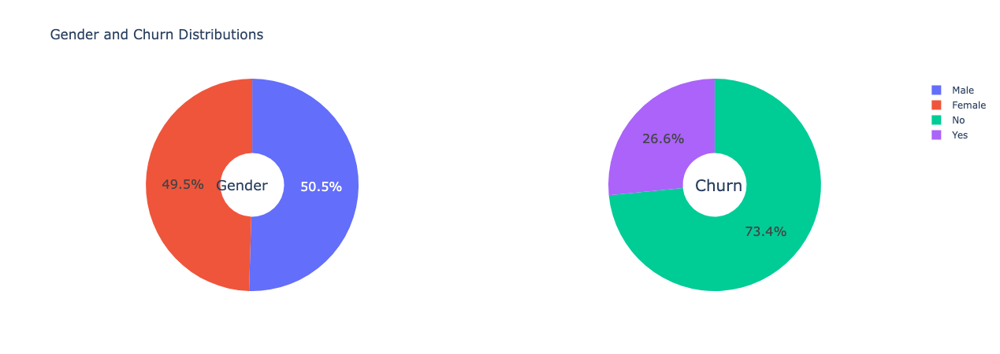
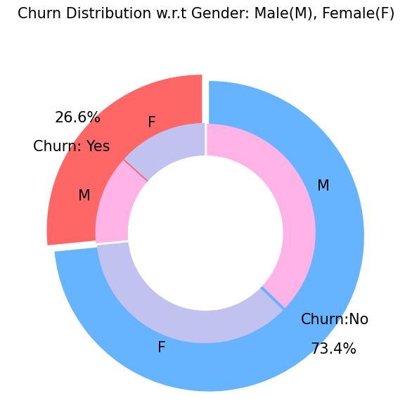
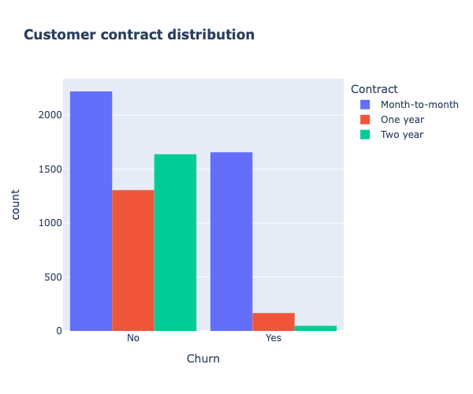
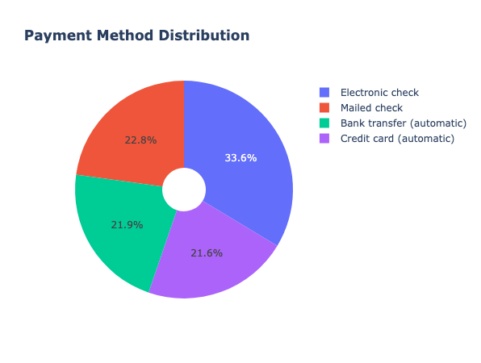

# Customer Churn Prediction

Customer churn prediction is the process of using data analysis and machine learning techniques to identify customers who are likely to stop using a product or service in the near future. It involves analyzing various data points, such as customer demographics, purchase history, usage patterns, and customer interactions, to create a predictive model that can identify customers who are at high risk of leaving. For **telecom** companies, by predicting which customers are most likely to churn, they can take proactive measures to retain these customers and improve their overall customer retention rates.

## Telecommunication Churn Prediction
Telecom churn prediction is a specific type of customer churn prediction that is focused on predicting when a customer of a telecommunications company (such as a mobile phone or internet service provider) is likely to switch to a competitor or cancel their subscription altogether. The goal of telecom churn prediction is to identify customers who are at risk of churning so that companies can take proactive measures to retain them, such as offering special promotions or discounts.

By identifying and addressing the underlying causes of customer churn, telecom companies can improve their service offerings, address customer complaints, and develop more effective marketing strategies. Ultimately, telecom customer churn prediction can help telecom companies maintain a competitive edge and drive growth in a highly competitive marketplace.

## Dataset

The IBM Telco customer churn data contains information about a fictional telco company that provided home phone and Internet services to 7043 customers in California in Q3. It indicates which customers have left, stayed, or signed up for their service. Multiple important demographics are included for each customer, as well as a Satisfaction Score, Churn Score, and Customer Lifetime Value (CLTV) index. A variety of objects have been updated/created that work together to tell a comprehensive story. Dataset can be accessd from here: https://www.kaggle.com/datasets/blastchar/telco-customer-churn

## Data Visualizations

- #### Gender and Chrun Distributions
  

    - `26.6%` of customers switched to another firm.
    - `49.5%` female and `50.5%` male.

- ### Combined Gender and Churn Distribution
  

    - `73.4%` of customers retained in the firm.
    - `49.5%` female and `50.5%` male.

- ### Customer Contract Distribution
  

    - `Month-to-Month` being highest for churning.

- ### Payment Method Distribution
  

    - `Electronic Check` with `33.6%` being highest for churning followed by `Mailed Check`, `Bank Transfer` and `Credit Card` with `22.8%`, `21.9%` and `21.6%` respectively.

- ### Payment Churn Distribution
  

## Train/Test Splits

| Labels  | Shape        |
|---------|--------------|
| X-Train | `(4922, 30)` |
| X-Test  | `(2110, 30)` |
| Y-Train | `(4922,)`    |
| Y-Test  | `(2110,)`    |

## ML Evaluation for Models

The dataset was further applied on traditional machine learning models such as Logistic Regression, Support Vector Machines, KNN Classifiers, Decision Trees, Randome Forests, Adaboost and Gradient Boosted Trees where their F1 scores, Precision and Recalls were compared using confusion matrices. The results are as follows:
  
  | Models                 | F1 Score  | Precision | Recall    |
  |------------------------|---------- |-----------|-----------|
  | Logistic Regression    | `0.79`    | `0.73`    | `0.71`    |
  | Support Vector Machine | `0.79`    | `0.78`    | `0.79`    |
  | KNN Classifier         | `0.75`    | `0.74`    | `0.75`    |
  | Decision Trees         | `0.72`    | `0.72`    | `0.72`    |
  | Random Forest          | `0.77`    | `0.76`    | `0.77`    |
  | Adaboost               | `0.80`    | `0.79`    | `0.80`    |
  | Gradient Boosting      | `0.79`    | `0.78`    | `0.79`    |

A Voting based classifier was also implemented which is an ensemble model using Gradient Boosting, Logistic Regression and Adaboost Classifier for making predictions and the results are as follows:

  | Models                 | F1 Score  | Precision | Recall    |
  |------------------------|---------- |-----------|-----------|
  | Voting Classifier (Ensemble of Gradient Boosting, Logistic Regression & Adaboost Classifier)                | `0.80`    | `0.79`    | `0.80`    |

## Conclusion
